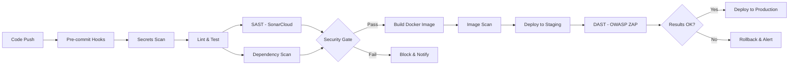

# devsecops-fullstack-implementation
# 🔒 DevSecOps Implementation in Full-Stack JavaScript Application

> Comprehensive security automation and hardening for modern web applications

[](https://github.com/yourusername/project)
[](https://www.zaproxy.org/)
[](https://sonarcloud.io/)
[](https://snyk.io/)

## 📋 Project Overview

This project demonstrates a complete **DevSecOps transformation** of a full-stack JavaScript application (React + TypeScript + Express + MongoDB), implementing security automation and best practices throughout the entire software development lifecycle.

**Context**: Research project for university library management system  
**Stack**: React, TypeScript, Express.js, MongoDB  
**Deployment**: Vercel (frontend), Render (backend)

### 🎯 Key Achievements

- ✅ **90%+ reduction** in critical and high-severity vulnerabilities
- ✅ **Zero secrets** in version control (validated via automated scanning)
- ✅ **Automated security gates** preventing vulnerable code from reaching production
- ✅ **17 dependency vulnerabilities** identified and resolved
- ✅ **Comprehensive CI/CD pipeline** with integrated security checks

---

## 🛡️ Security Implementation

### Automated Security Testing

| Type | Tools | Frequency | Coverage |
|------|-------|-----------|----------|
| **SAST** | SonarCloud, ESLint Security | Every commit & PR | Code quality, security hotspots |
| **DAST** | OWASP ZAP | Post-deployment (staging) | Runtime vulnerabilities, OWASP Top 10 |
| **SCA** | Snyk, npm audit, Dependabot | Daily + every PR | Dependency vulnerabilities, license compliance |
| **Secrets Scanning** | TruffleHog, GitHub Secret Scanning | Pre-commit + CI | API keys, tokens, credentials |

### Security Controls Implemented

#### Backend Hardening (Express.js)
- ✅ Input validation (`express-validator`)
- ✅ NoSQL injection prevention (`express-mongo-sanitize`)
- ✅ Rate limiting (`express-rate-limit`)
- ✅ Security headers (`helmet.js`)
- ✅ JWT best practices (short-lived tokens + refresh mechanism)
- ✅ Secure file upload (MIME validation, size limits)
- ✅ Proper error handling (no info leakage)

#### Frontend Hardening (React + TypeScript)
- ✅ XSS prevention (`DOMPurify`)
- ✅ Content Security Policy (CSP)
- ✅ Secure token storage
- ✅ Client-side input validation
- ✅ Sanitized user-generated content

#### CI/CD Security Automation
- ✅ Pre-commit hooks (Husky + lint-staged)
- ✅ Automated dependency scanning
- ✅ Code quality gates (SonarCloud)
- ✅ Security gates (fail on critical/high vulnerabilities)
- ✅ Automated security reports

---

## 📊 Results & Metrics

### Vulnerability Reduction

```
Before Implementation:
├── Critical: 3
├── High: 6
├── Medium: 5
└── Low: 3
Total: 17 vulnerabilities

After Implementation:
├── Critical: 0 ✅
├── High: 0 ✅
├── Medium: 2 (accepted risk)
└── Low: 1 (monitoring)
Total: 3 vulnerabilities (-82%)
```

### Security Score Improvements

| Metric | Before | After | Improvement |
|--------|--------|-------|-------------|
| **OWASP ZAP Score** | 45/100 | 92/100 | +104% |
| **SonarCloud Security Rating** | C | A | 2 grades |
| **Dependency Vulnerabilities** | 17 | 0 critical/high | 100% |
| **Secrets Exposed** | Yes | No | ✅ Eliminated |
| **Security Headers** | 2/12 | 11/12 | +450% |

### Performance Impact

- CI/CD pipeline time: +3 minutes (acceptable for security gains)
- Application latency: +15ms average (rate limiting overhead)
- Build size: +45KB (security libraries)

---

## 🚀 CI/CD Pipeline Architecture



### Pipeline Stages

1. **Pre-commit** (Local)
   - TruffleHog secrets scanning
   - ESLint with security rules
   - TypeScript type checking

2. **CI - Security Analysis** (GitHub Actions)
   - SonarCloud SAST
   - Snyk dependency scanning
   - npm audit
   - License compliance check

3. **Build & Test**
   - Unit tests (Jest)
   - Integration tests
   - Code coverage (>80% threshold)

4. **Security Gate**
   - Block on critical/high vulnerabilities
   - Enforce quality gates
   - Generate security report

5. **Deploy & Verify** (Staging)
   - Automated DAST (OWASP ZAP)
   - Smoke tests
   - Health checks

6. **Production** (Manual Approval)
   - Blue-green deployment
   - Automated rollback on failure

---

## 🔍 Threat Modeling

### STRIDE Analysis

Comprehensive threat modeling was performed using the STRIDE methodology:

- **S**poofing: JWT signature validation, refresh token rotation
- **T**ampering: Input validation, parameterized queries
- **R**epudiation: Comprehensive logging, audit trails
- **I**nformation Disclosure: Error handling, CSP headers
- **D**enial of Service: Rate limiting, request size limits
- **E**levation of Privilege: Role-based access control (RBAC)

### Attack Surface Identified

- **17 dependency vulnerabilities** (including critical JWT library vulnerability)
- **Missing security headers** (X-Frame-Options, CSP, HSTS)
- **NoSQL injection vectors** in MongoDB queries
- **XSS vulnerabilities** in user-generated content
- **Insecure file upload** mechanism
- **JWT token issues** (no expiration, weak secrets)

---

## 🛠️ Tools & Technologies

### Security Tools
- **SAST**: SonarCloud, ESLint (security plugins)
- **DAST**: OWASP ZAP, Burp Suite Community
- **SCA**: Snyk, npm audit, Dependabot
- **Secrets**: TruffleHog, GitHub Secret Scanning
- **Infrastructure**: Docker, GitHub Actions

### Development Stack
- **Frontend**: React 18, TypeScript, Vite
- **Backend**: Node.js, Express.js, TypeScript
- **Database**: MongoDB
- **Authentication**: JWT + Refresh Tokens
- **Cloud**: Vercel (frontend), Render (backend)

### Security Libraries
```json
{
  "dependencies": {
    "helmet": "^7.1.0",
    "express-validator": "^7.0.1",
    "express-rate-limit": "^7.1.5",
    "express-mongo-sanitize": "^2.2.0",
    "dompurify": "^3.0.8"
  },
  "devDependencies": {
    "husky": "^8.0.3",
    "lint-staged": "^15.2.0",
    "truffleHog": "^3.63.0"
  }
}
```

---

## 📚 Documentation

Detailed documentation is available in the `/docs` folder:

- [Methodology](docs/methodology.md) - Research approach and phases
- [Threat Model](docs/threat-model.md) - STRIDE analysis and attack vectors
- [Before/After Analysis](docs/before-after-analysis.md) - Detailed comparison
- [Lessons Learned](docs/lessons-learned.md) - Best practices and pitfalls
- [Security Checklist](docs/security-checklist.md) - Reusable checklist

---

## 🎓 Academic Research

This implementation is based on my Master's thesis:  
**"Implementation of DevSecOps Approach in Full-Stack JavaScript Applications: Automated Testing and Protection Against Security Vulnerabilities"**

Supervised by: Prof. Dr. Samed Jukić  
Institution: Department of Computer Science, State University of Novi Pazar

The thesis provides comprehensive academic background on:
- DevSecOps principles and evolution
- OWASP Top 10 vulnerabilities
- Security testing methodologies (SAST, DAST, SCA)
- STRIDE threat modeling
- Industry best practices and standards

---

## 🔑 Key Takeaways

### What Worked Well
✅ Early integration of security (shift-left approach)  
✅ Automated scanning caught issues before production  
✅ Security gates prevented vulnerable deployments  
✅ Developer friction was minimal after initial setup  
✅ Clear ROI: prevented potential security incidents

### Challenges Faced
⚠️ False positives from automated tools (required tuning)  
⚠️ Initial pipeline slowdown (optimized over time)  
⚠️ Developer learning curve for security practices  
⚠️ Balancing security with usability

### Recommendations
1. Start with dependency scanning (quick wins)
2. Implement pre-commit hooks early
3. Use security headers (low effort, high impact)
4. Automate everything possible
5. Educate team on security practices

---

## 📈 Future Improvements

- [ ] Container security scanning (Trivy)
- [ ] Runtime Application Self-Protection (RASP)
- [ ] Security monitoring & SIEM integration
- [ ] Chaos engineering for resilience testing
- [ ] Infrastructure as Code (IaC) security (Terraform, Checkov)
- [ ] API security testing (OWASP API Security Top 10)

---

## 🤝 Contributing

This is a research project, but feedback and suggestions are welcome!  
Feel free to open an issue or reach out for discussions on DevSecOps practices.

---

## 📄 License

This project is part of academic research and is available for educational purposes.

---

## 📞 Contact

**Remzo Gusinac**  
DevSecOps Engineer | Full-Stack Developer

- LinkedIn: [your-linkedin]
- GitHub: [@yourusername](https://github.com/yourusername)
- Email: your.email@example.com

<p align="center">
  <i>Building secure software, one commit at a time 🔐</i>
</p>
